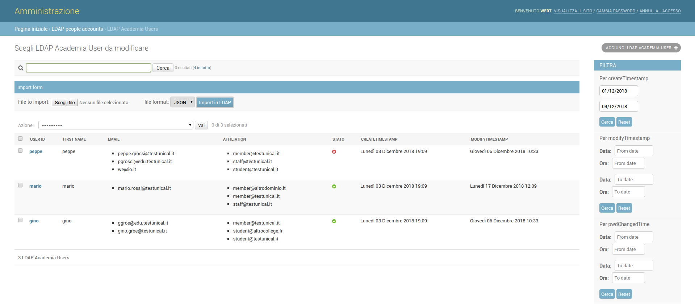

Django admin LDAP manager for Academia OU
-----------------------------------------
Django Admin manager for Academia Users, usable with a OpenLDAP Server configured with eduPerson, SCHAC (SCHema for ACademia) and Samba schema.
It also needs PPolicy overlay.

References
----------

- [OpenLDAP compatible configuration](https://github.com/peppelinux/ansible-slapd-eduperson2016)
- [eduPerson Schema](https://software.internet2.edu/eduperson/internet2-mace-dir-eduperson-201602.html)
- [SCHAC](https://wiki.refeds.org/display/STAN/SCHAC)

Requirements
------------

- OpenLDAP 2.4.x
- Python 3.x
- Django 2.x
- django-ldapdb (custom repository)


Tested on Debian9 and Debian 10.

Preview
-------

**Note:** Labels and strings can be localized with .po dictionaries (gettext). See [i18n documentation](https://docs.djangoproject.com/en/dev/topics/i18n/translation/)




LDAP Setup
-----
For those who need to setup a LDAP server for development or production use:
````
pip3 install ansible
git clone https://github.com/peppelinux/ansible-slapd-eduperson2016.git
cd ansible-slapd-eduperson2016
ansible-playbook -i "localhost," -c local playbook.yml
````
**Note:** The playbook will backup any existing slapd installations in **backups** folder.

Setup
-----

#### Create an environment directory and activate it
````
apt install python3-dev python3-pip python3-setuptools
pip3 install virtualenv

export PROJ_NAME=django-ldap-academia-ou-manager
export DEST_DIR=$PROJ_NAME.env
virtualenv -p python3 $DEST_DIR
source $dest_dir/bin/activate
pip3 install django
````

#### Create a project
````
django-admin startproject $PROJ_NAME
cd $PROJ_NAME
````

#### Install the app
**Note:** It uses a django-ldapdb fork to handle readonly (non editable) fields. This still waiting form merge in official django-ldap repository.

````
# pip3 install git+https://github.com/peppelinux/django-ldapdb.git
pip3 install git+https://github.com/peppelinux/django-ldap-academia-ou-manager --process-dependency-link
````

#### Edit settings.py
Read settings.py and settingslocal.py in the example folder.

In settings.py do the following:

- Add **ldap_peoples** in INSTALLED_APPS;
- import default ldap_peoples settings as follows;
- import default app url as follows;

#### import default ldap_peoples settings
````
# settings.py
if 'ldap_peoples' in INSTALLED_APPS:
    from ldap_peoples.settings import *
````
#### import default app url
````
# urls.py
if 'ldap_peoples' in settings.INSTALLED_APPS:
    import ldap_peoples.urls
    urlpatterns += path('', include(ldap_peoples.urls, namespace='ldap_peoples')),
````

Using the Object Relation Mapper
--------------------------------
One of the advantage of using the ORM is the possibility to make these kind of queries
to a LDAP database.

#### User update attributes
````
from ldap_peoples.models import LdapAcademiaUser
lu = LdapAcademiaUser.objects.get(uid='mario')

# as multivalue
lu.eduPersonAffiliation.append('alumn')
lu.save()

lu.set_password('secr3tP4ss20rd')

# search into multivalue field
other_lus = LdapAcademiaUser.objects.filter(mail_contains='unical')

````

#### User creation example
````
# user creation
import datetime

d = {'cn': 'pedppe',
     'displayName': 'peppde Rossi',
     'eduPersonAffiliation': ['faculty', 'member'],
     'eduPersonEntitlement': ['urn:mace:terena.org:tcs:escience-user',
      'urn:mace:terena.org:tcs:personal-user'],
     'eduPersonOrcid': '',
     'eduPersonPrincipalName': 'grodsfssi@unical',
     'eduPersonScopedAffiliation': ['member@testunical.it', 'staff@testunical.it'],
     'givenName': 'peppe',
     'mail': ['peppe44.grossi@testunical.it', 'pgros44si@edu.testunical.it'],
     'sambaNTPassword': 'a2137530237ad733fdc26d5d7157d43f',
     'schacHomeOrganization': 'testunical.it',
     'schacHomeOrganizationType': ['educationInstitution', 'university'],
     'schacPersonalUniqueID': ['urn:schac:personalUniqueID:IT:CF:CODICEFISCALEpe3245ppe'],
     'schacPlaceOfBirth': '',
     'sn': 'grossi',
     'telephoneNumber': [],
     'uid': 'perrrppe',
     'userPassword': '{SHA512}oMKZtxqeWdXrsHkX5wYBo1cKoQPpmnu2WljngOyQd7GQLR3tsxsUV77aWV/k1x13m2ypytR2JmzAdZDjHYSyBg=='}

u = LdapAcademiaUser.objects.create(**d)
u.delete()
````

#### Unit test
````
./manage.py test ldap_peoples.test.LdapAcademiaUserTestCase
````

TODO
----
 - form .clean methods could be cleaned with a better OOP refactor on FormFields and Widgets;


 **Django-ldapdb related**
 - We use custom django-ldapdb fork because readonly fields like createTimestamps and other are fautly on save in the official django-ldapdb repo. [See related PR](https://github.com/django-ldapdb/django-ldapdb/pull/185);
 - ListFields doesn't handle properly **verbose_name**. It depends on the form class, we use our fork for elude this;
 - Aggregate lookup for evaluating min max on records, this come from django-ldapdb;
 - too many connection from django-ldapdb backends, fixed in forked django-ldapdb version as follow:

````
# backeds.ldap.base#237
    def ensure_connection(self):
        super(DatabaseWrapper, self).ensure_connection()

        # Do a test bind, which will revive the connection if interrupted, or reconnect
        conn_params = self.get_connection_params()

        # this creates too many connections to LDAP server!
        # try:
            # self.connection.simple_bind_s(
                # conn_params['bind_dn'],
                # conn_params['bind_pw'],
            # )
            # print('ensure_connection. try')
        # except ldap.SERVER_DOWN:

        if not self.connection:
            self.connect()
            # print('ensure_connection. except')
````
